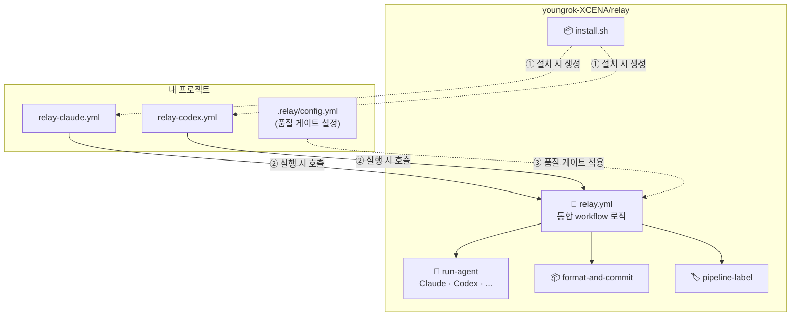
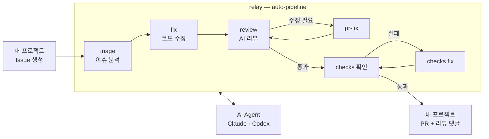

# Relay for AI Agents

```
🏃 triage → 🏃 fix → 🏃 review → 🏃 pr-fix → 🏃 checks-fix
  분석        구현       검증        후속 수정      CI 반영
```

이슈 하나 던지면 분석부터 PR 생성, 리뷰, 후속 수정까지 사람 개입 없이 돌아가는 자율 개발 루프.

## Quick Start

> 설치 스크립트가 self-hosted runner를 자동으로 등록한다. **runner가 동작할 머신(Linux)에서 설치를 실행**해야 한다.

> 팀 repo에 바로 설치하기 전에, **개인 fork에 먼저 설치해서 테스트**하는 것을 권장한다.

### 1. Prerequisites

- [GitHub CLI](https://cli.github.com/) (`gh`) 설치 및 로그인
- [Claude Code](https://docs.anthropic.com/en/docs/claude-code) 또는 [Codex](https://github.com/openai/codex) 설치 및 로그인 (하나 이상)
- [GitHub Personal Access Token](https://github.com/settings/tokens) 생성 (필요 권한: `repo`, `workflow`)

> AI agent 실행 시 로그인된 계정의 API 크레딧이 소모된다. 특히 auto-pipeline은 여러 단계를 자동 반복하므로 사용량에 유의.

### 2. Install

Relay를 설치할 프로젝트 루트에서 실행한다. `GH_PAT` 환경변수는 필수다.

```bash
export GH_PAT=ghp_xxxx   # 위에서 생성한 Personal Access Token
curl -sL https://raw.githubusercontent.com/youngrok-XCENA/relay/main/install.sh | bash
```

설치 후 `.github/workflows/`에 생성된 workflow 파일을 확인한다.

### 3. Verify

```bash
curl -sL https://raw.githubusercontent.com/youngrok-XCENA/relay/main/verify.sh | bash
```

workflow 파일, GH_PAT secret, runner 등록 상태를 확인한다.

### 4. 파이프라인 테스트

설치가 끝나면 이슈 하나로 전체 파이프라인을 확인할 수 있다.

```bash
gh issue create --title "claude-auto 첫 번째 개선" \
  --body "현재 코드에서 가장 가치 있는 개선 하나를 골라 수정해 주세요."
```

AI가 코드를 분석 → 수정 → PR 생성 → 리뷰 → 후속 패치까지 자동으로 진행한다.

## Features

| 직접 구축하면 | 이 프로젝트를 쓰면 |
|---|---|
| workflow 작성, runner 설정, secret 관리를 repo마다 반복 | **한 줄 설치**로 끝 |
| AI 도구를 별도로 배워야 함 | PR/Issue 코멘트에 명령어 입력 — **기존 워크플로 그대로** |
| 리뷰 요청 → 수정 → 재리뷰를 사람이 반복 | **자율 파이프라인**이 분석부터 수정, 리뷰, 반복까지 무인 수행 |
| repo마다 workflow 로직 산재 | **relay에서 일괄 관리** — 이 repo 하나를 업데이트하면 모든 프로젝트에 반영 |

## Architecture

- **relay** (`youngrok-XCENA/relay`): AI agent workflow의 모든 로직이 있는 repo. 이 프로젝트 자체.
- **내 프로젝트**: AI CI를 설치할 대상. relay를 호출하는 가벼운 workflow 파일만 갖는다.



하나의 `relay.yml`이 `agent` 파라미터로 Claude/Codex를 구분한다. 새 에이전트 추가 시 `run-agent`에 CLI 호출만 추가하면 된다.

내 프로젝트에는 가벼운 workflow 파일만 있으므로, relay를 업데이트하면 모든 프로젝트에 일괄 반영된다.

### Data flow

이슈 하나로 분석부터 PR 생성, 리뷰, CI 반영까지 무인으로 실행되는 흐름:



## 사용법

### PR 리뷰

PR 코멘트에 명령을 입력한다.

```
/claude-review
/codex-review
```

프롬프트를 추가해 리뷰 관점을 지정할 수 있다.

```
/claude-review 메모리 안전성 위주로 확인
```

### Issue 분석 (triage)

issue 제목에 `claude` 또는 `codex`를 포함하면 자동으로 분석이 시작된다.

수동 트리거:

```
/claude-issue
/codex-issue
```

### Issue 수정 (fix)

issue 코멘트에 입력하면 AI가 코드를 수정하고 PR을 생성한다.

```
/claude-fix
/codex-fix
```

PR 코멘트에서 `/claude-fix`를 입력하면 해당 PR에 직접 수정을 push한다.

### 자동 파이프라인 (auto-pipeline)

사람 개입 없이 **이슈 분석 → 코드 수정 → PR 생성 → AI 리뷰 → 후속 수정**을 자동으로 반복한다. 흐름은 위 [데이터 플로우](#auto-pipeline-데이터-플로우) 참조.

이슈를 만들면 바로 시작된다. 제목 어디든 `claude-auto` 또는 `codex-auto`가 포함되면 된다.

```
gh issue create --title "claude-auto 로깅 개선" --body "에러 발생 시 스택트레이스가 누락됨"
gh issue create --title "에러 핸들링 추가 / codex-auto" --body "API 타임아웃 처리 필요"
```

이미 있는 이슈에 `auto-fix` 라벨을 붙여도 동일하게 트리거된다.

### 파이프라인 상태 추적

auto-pipeline 실행 시 이슈에 자동으로 라벨이 달린다.

```
pipeline:analyzing → pipeline:fixing → pipeline:creating-pr
→ pipeline:reviewing → pipeline:patching → pipeline:checking
→ pipeline:complete (또는 pipeline:failed / pipeline:needs-human)
```

이슈 보드에서 파이프라인 진행 상태를 한눈에 파악할 수 있다.

### 스케줄 CI (선택)

`claude-schedule.yml` / `codex-schedule.yml` 내 예시 내용을 참고하여 프로젝트에 맞게 수정해서 사용하면 된다. 기본 비활성화.

## 설정 커스터마이징

설치 후 생성된 `relay-claude.yml` / `relay-codex.yml`을 직접 수정해서 프로젝트에 맞게 조정할 수 있다.

### 품질 게이트 (.relay/config.yml)

프로젝트 루트에 `.relay/config.yml`을 두면 auto-pipeline에 품질 게이트를 적용할 수 있다.

```yaml
quality_gates:
  # CRITICAL/HIGH 이슈가 0개여야 파이프라인 완료
  max_critical_issues: 0

  # 이 패턴에 매칭되는 파일 변경 시 사람 승인 필요
  require_human_approval:
    - "*.yml"           # CI/CD 설정
    - "Dockerfile"
    - ".env*"

pipeline:
  max_check_fix_attempts: 3
  timeout_minutes: 60
```

`require_human_approval`에 매칭되면 `pipeline:needs-human` 라벨이 달리고 파이프라인이 일시 중단된다. 사람이 확인 후 `auto-fix` 라벨을 다시 달면 재개된다.

설정 예시: [.relay/config.example.yml](.relay/config.example.yml)

## 명령어 요약

| 명령어 | 위치 | 동작 |
|---|---|---|
| `/claude-review` | PR 코멘트 | AI 코드 리뷰 |
| `/codex-review` | PR 코멘트 | AI 코드 리뷰 |
| `/claude-issue` | Issue 코멘트 | Issue 분석 |
| `/codex-issue` | Issue 코멘트 | Issue 분석 |
| `/claude-fix` | Issue 코멘트 | 코드 수정 + PR 생성 |
| `/codex-fix` | Issue 코멘트 | 코드 수정 + PR 생성 |
| `/claude-fix` | PR 코멘트 | PR에 직접 수정 push |
| `/codex-fix` | PR 코멘트 | PR에 직접 수정 push |

## 요구사항 & 제한사항

### 실행 환경

- **상시 가동 머신 필요**: 설치 스크립트가 해당 머신에 self-hosted runner를 등록하고, AI CLI를 통해 agent를 실행한다. 이 머신이 꺼지면 workflow가 동작하지 않는다.
- **필수 도구**: `gh` (GitHub CLI), `git`, `jq`, Node.js (AI CLI 설치용)

### 개인 fork 권고

auto-pipeline, `/claude-fix` 등은 issue와 PR을 자동 생성한다. 팀 repo에 직접 설치하면 AI가 생성한 issue/PR이 팀 워크플로에 섞일 수 있으므로, 먼저 **개인 fork에 설치해서 테스트**한 뒤 팀 repo에 적용하는 것을 권장한다.

## 문서

- 설계: [docs/design.md](docs/design.md)
- 플랫폼 아키텍처 고도화: [docs/platform-architecture-enhancement.md](docs/platform-architecture-enhancement.md)
- 수동 테스트: [docs/test-guide.md](docs/test-guide.md)
- 테스트 시나리오: [docs/test-scenario.md](docs/test-scenario.md)