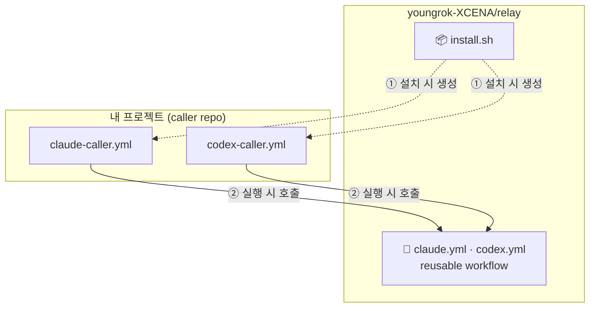
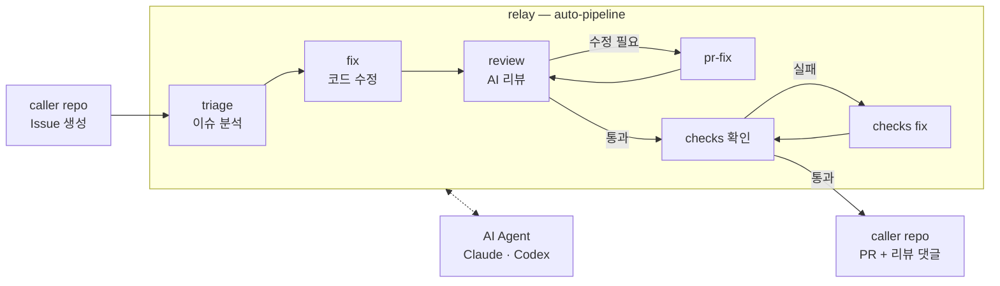
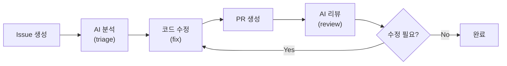

# youngrok-XCENA/relay

GitHub repo에 AI agent 자동 개발 파이프라인을 한 줄로 구축한다.

caller repo의 이벤트를 받아 AI agent workflow로 중계(relay)하는 허브.

이슈 분석 → 코드 수정 → PR 생성 → 리뷰 → 후속 수정까지, 사람 개입 없이 돌아가는 자율 개발 루프.

## Quick Start

> 설치 스크립트가 self-hosted runner를 자동으로 등록한다. **runner가 동작할 머신(Linux)에서 설치를 실행**해야 한다.

> 팀 repo에 바로 설치하기 전에, **개인 fork에 먼저 설치해서 테스트**하는 것을 권장한다.

### 1. 사전 준비

- [GitHub CLI](https://cli.github.com/) (`gh`) 설치 및 로그인
- AI CLI 설치 및 로그인:
  ```bash
  # Claude (필수)
  npm install -g @anthropic-ai/claude-code
  claude login

  # Codex (선택)
  npm install -g @openai/codex
  codex login
  ```
- [GitHub Personal Access Token](https://github.com/settings/tokens) 생성 (필요 권한: `repo`, `workflow`)

> AI agent 실행 시 로그인된 계정의 API 크레딧이 소모된다. 특히 auto-pipeline은 여러 단계를 자동 반복하므로 사용량에 유의.

### 2. 설치

caller repo 루트에서 실행한다.

```bash
# 방법 1: 인라인
GH_PAT=ghp_xxxx bash <(gh api repos/youngrok-XCENA/relay/contents/install.sh --jq '.content' | base64 -d)

# 방법 2: export
export GH_PAT=ghp_xxxx
bash <(gh api repos/youngrok-XCENA/relay/contents/install.sh --jq '.content' | base64 -d)
```

설치 후 `.github/workflows/` 하위에 생성된 caller yml을 확인한다.

### 3. 검증

```bash
bash <(gh api repos/youngrok-XCENA/relay/contents/verify.sh --jq '.content' | base64 -d)
```

workflow 파일, GH_PAT secret, runner 등록 상태를 확인한다.

## Features

| 직접 구축하면 | 이 프로젝트를 쓰면 |
|---|---|
| workflow 작성, runner 설정, secret 관리를 repo마다 반복 | **한 줄 설치**로 끝 |
| AI 도구를 별도로 배워야 함 | PR/Issue 코멘트에 명령어 입력 — **기존 워크플로 그대로** |
| 리뷰 요청 → 수정 → 재리뷰를 사람이 반복 | **자율 파이프라인**이 분석부터 수정, 리뷰, 반복까지 무인 수행 |
| repo마다 workflow 로직 산재 | **relay에서 일괄 관리** — 이 repo 하나를 업데이트하면 모든 프로젝트에 반영 |

## 아키텍처

- **relay** (`youngrok-XCENA/relay`): AI agent workflow의 모든 로직을 보유한다. 이 repo 자체.
- **caller repo**: AI 파이프라인을 설치할 내 프로젝트. relay의 workflow를 호출하는 얇은 caller 파일만 갖는다.



caller repo는 thin caller만 갖기 때문에, relay를 업데이트하면 모든 프로젝트에 일괄 반영된다.

### auto-pipeline 데이터 플로우

이슈 하나로 분석부터 PR 생성, 리뷰, CI 반영까지 무인으로 실행되는 흐름:



## 사용법

### PR 리뷰

PR 코멘트에 명령을 입력한다.

```
/claude-review
/codex-review
```

프롬프트를 추가해 리뷰 관점을 지정할 수 있다.

```
/claude-review 메모리 안전성 위주로 확인
```

### Issue 분석 (triage)

issue 제목에 `claude` 또는 `codex`를 포함하면 자동으로 분석이 시작된다.

수동 트리거:

```
/claude-issue
/codex-issue
```

### Issue 수정 (fix)

issue 코멘트에 입력하면 AI가 코드를 수정하고 PR을 생성한다.

```
/claude-fix
/codex-fix
```

PR 코멘트에서 `/claude-fix`를 입력하면 해당 PR에 직접 수정을 push한다.

### 자동 파이프라인 (auto-pipeline)

사람 개입 없이 **이슈 분석 → 코드 수정 → PR 생성 → AI 리뷰 → 후속 수정**을 자동으로 반복한다.



트리거 방법:

| 방법 | 예시 |
|---|---|
| issue 제목에 키워드 포함 | `claude-auto 로깅 개선`, `codex-auto 에러 핸들링` |
| issue에 라벨 추가 | `auto-fix` 라벨 |
| 스케줄 (Codex) | caller repo에서 `schedule` 트리거 추가 시 자동 issue 생성 → 파이프라인 실행 |

## 설정 커스터마이징

`install.sh`가 생성하는 caller workflow의 주요 파라미터:

| 파라미터 | 기본값 | 설명 |
|---|---|---|
| `project_description` | `GitHub repository owner/repo` | 프로젝트 설명 (AI 컨텍스트) |
| `code_style_guide` | `""` | 코딩 스타일 힌트 |
| `file_extensions` | `*.yml *.yaml *.sh *.json ...` | 리뷰 대상 파일 패턴 |
| `build_command` | `""` | fix 후 빌드 검증 명령 |
| `test_command` | `""` | fix 후 테스트 검증 명령 |
| `base_branch` | GitHub 기본 브랜치 (자동 감지) | fix 기준 브랜치 |
| `timeout_minutes` | 모드별 상이 | 실행 제한 시간 |

생성된 `claude-caller.yml` / `codex-caller.yml`을 직접 수정해서 프로젝트에 맞게 조정할 수 있다.

## 명령어 요약

| 명령어 | 위치 | 동작 |
|---|---|---|
| `/claude-review` | PR 코멘트 | AI 코드 리뷰 |
| `/codex-review` | PR 코멘트 | AI 코드 리뷰 |
| `/claude-issue` | Issue 코멘트 | Issue 분석 |
| `/codex-issue` | Issue 코멘트 | Issue 분석 |
| `/claude-fix` | Issue 코멘트 | 코드 수정 + PR 생성 |
| `/codex-fix` | Issue 코멘트 | 코드 수정 + PR 생성 |
| `/claude-fix` | PR 코멘트 | PR에 직접 수정 push |

## 요구사항 & 제한사항

### 실행 환경

- **상시 가동 머신 필요**: 설치 스크립트가 해당 머신에 self-hosted runner를 등록하고, AI CLI를 통해 agent를 실행한다. 이 머신이 꺼지면 workflow가 동작하지 않는다.
- **필수 도구**: `gh` (GitHub CLI), `git`, `jq`, Node.js (AI CLI 설치용)

### 개인 fork 권고

auto-pipeline, `/claude-fix` 등은 issue와 PR을 자동 생성한다. 팀 repo에 직접 설치하면 AI가 생성한 issue/PR이 팀 워크플로에 섞일 수 있으므로, 먼저 **개인 fork에 설치해서 테스트**한 뒤 팀 repo에 적용하는 것을 권장한다.

### GitHub PAT 권한

`repo`, `workflow` 스코프가 필요하다. fine-grained token은 현재 지원하지 않는다 (workflow 권한 미지원).

## 문서

- 설계: [docs/design.md](docs/design.md)
- 수동 테스트: [docs/test-guide.md](docs/test-guide.md)
- 테스트 시나리오: [docs/test-scenario.md](docs/test-scenario.md)
