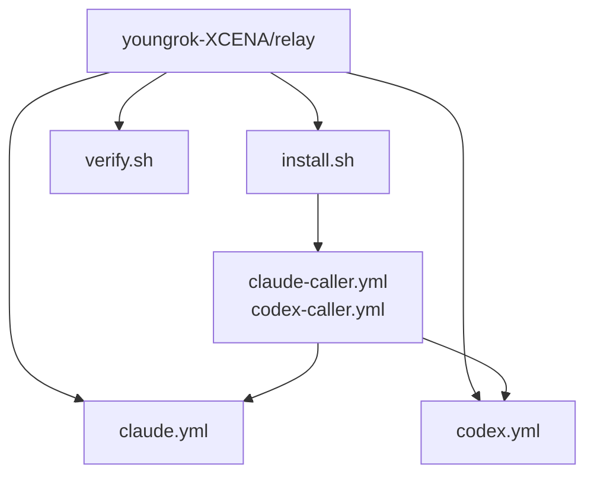

# CI Workflow 설계문서

`youngrok-XCENA/relay`는 agent-based reusable workflow를 관리하는 relay repo다.

현재 범위:

- `claude.yml`
- `codex.yml`

여기는 일반 lint / static analysis 모음이 아니라 `agent ci workflow repo`라는 전제를 둔다. 그래서 `code-style`, `cppcheck`은 제거했다.

## 아키텍처 개요



구조 원칙:

- reusable workflow는 relay에 집중
- caller repo는 thin caller workflow만 소유
- `install.sh`를 받아 실행하면 workflow 파일 생성 + secret 설정 + runner 등록까지 완료

## reusable workflow

### claude.yml

하나의 reusable workflow에서 아래 모드를 라우팅한다.

- `review`
- `fix`
- `pr-fix`
- `triage`
- `auto-pipeline`

주요 입력:

| Input | 기본값 | 설명 |
|------|------|------|
| `mode` | - | 실행 모드 |
| `project_description` | 자동 생성 | 프로젝트 설명 |
| `code_style_guide` | `""` | 스타일 힌트 |
| `build_command` | `""` | fix 검증용 빌드 명령 |
| `test_command` | `""` | fix 검증용 테스트 명령 |
| `file_extensions` | 넓은 기본값 | review 대상 파일 패턴 |
| `base_branch` | GitHub 기본 브랜치 | fix 기준 브랜치 |

### codex.yml

Claude와 같은 흐름이지만 runner / agent만 Codex다.

- `review`
- `fix`
- `triage`
- `auto-pipeline`
- scheduled `codex-auto` issue 생성

## install.sh

caller repo에서 실행하면 아래를 자동으로 수행한다.

```bash
GH_PAT=<token> bash install.sh
```

동작:

1. 현재 git repo와 GitHub remote 자동 감지
2. GitHub API로 기본 브랜치 자동 감지
3. `claude-caller.yml`, `codex-caller.yml` 생성
4. `GH_PAT` secret 설정
5. `claude-ci`, `codex-ci` self-hosted runner 등록

자동 기본값:

- `base_branch`: GitHub repo의 기본 브랜치 (자동 감지)
- `project_description`: `GitHub repository owner/repo`
- `code_style_guide`: 빈 문자열
- `file_extensions`: 넓은 기본 코드 패턴

## verify.sh

설치 후 검증 스크립트다. 아래를 확인한다.

1. `claude-caller.yml` 존재 여부
2. `codex-caller.yml` 존재 여부
3. `GH_PAT` secret 설정 여부
4. self-hosted runner 등록 여부

```bash
bash verify.sh
```
